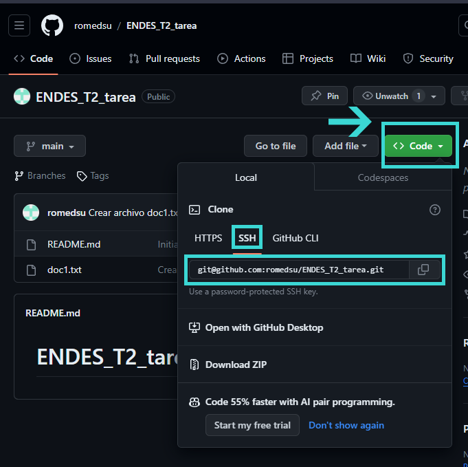
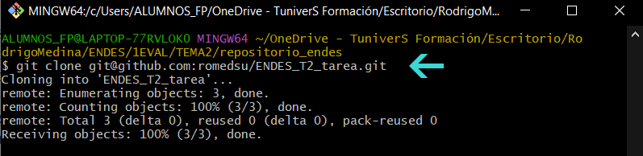
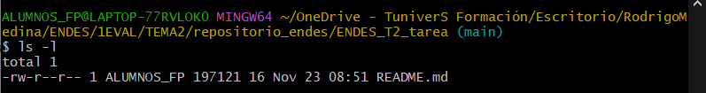
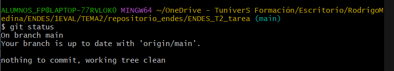
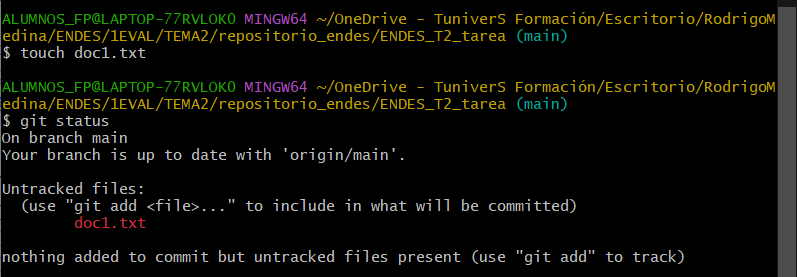
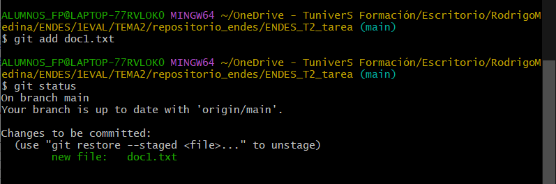
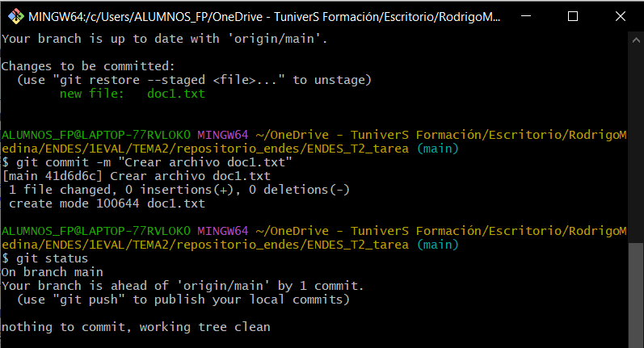
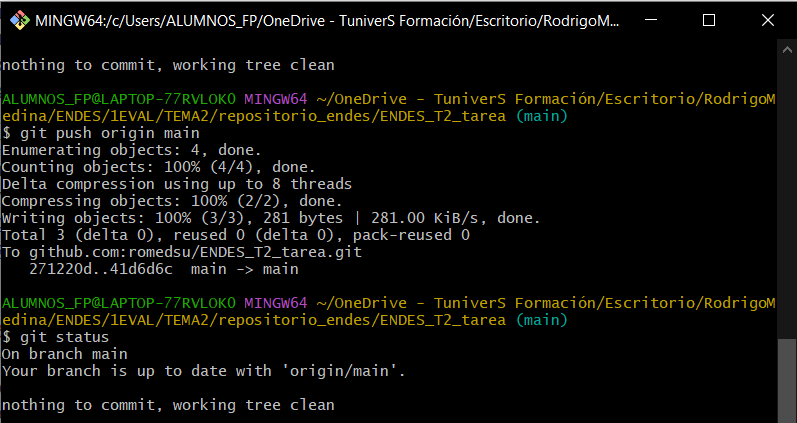
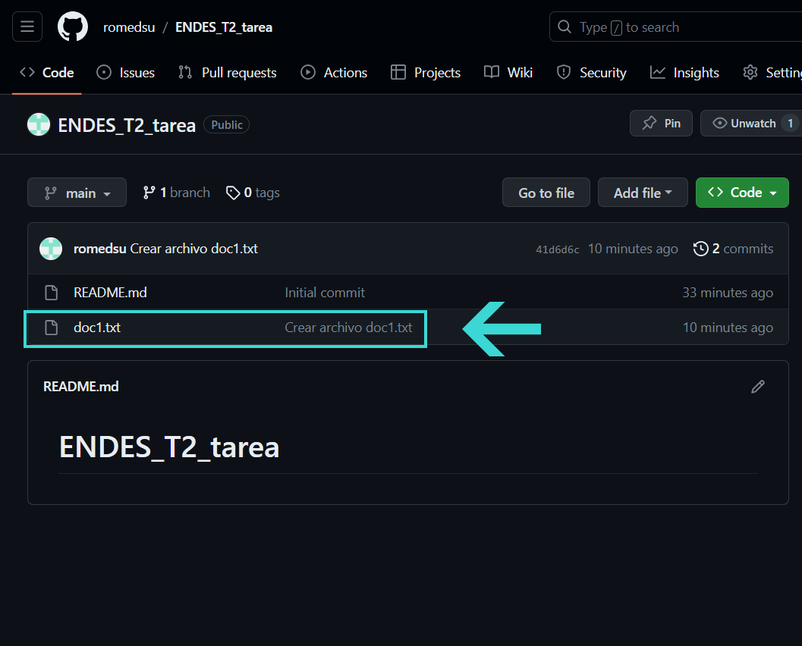

# Actividad Tema 2 | ENDES

## SUBTAREA 1 | Uso de GitHub y Git

### 1 - 3.
Pasos ya realizados con anterioridad

### 4. Clonar el repositorio vacío

4.1.  Dentro del repositorio que hemos creado en GitHub, copiamos en el portapapeles el código SSH.

4.2. En Git Bash, accedemos a la ruta en la ruta donde lo queremos clonar. Escribimos la línea `git clone` y pegamos lo que hemos copiado en el portapapeles:

~~~
git clone "Tu copia SSH"
~~~
 

### 5. Ejecutar comando ls

A través del comando `ls -l` podemos ver el contenido de la carpeta en la que nos encontramos.

### 6. Git Status al día

Mostramos que el repositorio está actualizado, sin ningún archvo pendiente.

~~~
git status
~~~

### 7. Git Status pendiente

Tras realizar un cambio en la carpeta (nuevo documento) y volver a introducir `git status` nos indica en <strong>rojo</strong> el archivo pendiente de actualización al repositorio.

### 8. Git Add | Fase Staged

Agregamos los archivos que queremos subir y nos mostrará en <strong>verde</strong> el archivo que ya está en la fase staged, listo para actualizar el repositorio.

~~~
git add "Tu archivo"
~~~

### 9. Git Commit

Para confirmar la subida de los archivos al repositorio introducimos:

~~~
git commit -m "Mensaje que desees"
~~~

>[!NOTE]
>A través del comando `-m` puedes añadir el mensaje que desees para tener una información extra de la actualización posteriormente.

### 10. Git Push Origin Main

Para sincronizar nuestra subida con el repositorio en GitHub es necesario introducir el siguiente comando:

~~~
git push origin main
~~~

### 11. Repositorio actualizado en GitHub

Una vez concluidos los paso anteriores, nuestro repositorio en GitHub ya estará sincronizado con los nuevos cambios.

 
***
 

## SUBTAREA 2 | Comprobación de dos IDEs o editores de texto

Tanto los **IDEs** (Entorno de desarrollo integrado) como los **editores de texto** son herramientas que facilitan el trabajo para los desarrolladores informáticos. 

Mientras que los IDEs  poseen funcionalidades más avanzadas (depuración, compilación, análisis de código, etc.), los editores de texto son herramientas más simples y ligeras, aunque también poseen una gran personalización a través de amplios catálogos de plugins, que les dotan de funcionalidades más específicas.

## IntelliJ IDEA
**IntelliJ IDEA** es un IDE desarrollado por JetBrains que facilita la escritura, depuración, refactorización y mantenimiento del código en numerosos lenguajes de programación. Se considera una herramienta versátil con diversas funcionalidades.
  
* #### **Lenguajes de programación compatibles**
Este entorno de desarrollo se ofrece en dos versiones. 
	 
1. **Community Edition** (código abierto y gratuita)
		Destaca su uso para **JAVA, Phyton, GO o Kotlin**, entre otros

2. **Ultimate Edition** (de pago)
		Soporta numerosos lenguajes. Junto a los de la versión anterior se añaden **JavaScript, PHP o SQL**.
   
  

* #### **Facilidad de uso**
	* **Editor autocompletado**
		Integra un asistente que proporciona sugerencias y ayuda en el completado de código.
		 
	 * **Inspección de código**
		Análisis en tiempo real, lo que facilita la identificación y resolución de errores, proporcionando sugerencias para mejorar el rendimiento.
		 
* #### **Depuración**
	 Ofrece una herramienta de depuración integrada en tiempo real y la utilización de **puntos de interrupción** (marcadores especiales para indicar donde se desea que se detenga la ejecución).
	 
	 Del mismo modo, también ofrece la posibilidad de herramientas para **pruebas unitarias** para comprobar el correcto funcionamiento de fragmentos de código más pequeños.
	 	 
* #### **Gestión de versiones** 
	IntelliJ IDEA es compatible con los sistemas de control de versiones cómo **Git, Subversion, Mercurial y Peforce.**
	
	Permite clonar proyectos, administrar, revisar, confirmar y enviar cambios.
		 

* #### **Personalización y extensibilidad**
	Permite el uso de **plantillas en vivo y personalizadas** que ayudan a agilizar la codificación en diferentes proyectos.
   

* #### **Otros aspectos**
	- **Refactorización**
		 Este IDE posee una funcionalidad de refactorización automática, permitiendo reestructurar y mejorar el código existente, sin alterar su finalidad.
		  
	- **Asistente IA**
		 Herramienta de Inteligencia artificial  que ayuda en sugerencia de escritura de comentarios, nombres, mensajes de confirmación, etc.
		  
	 - **Multiplataforma**
		 Ofrece, tanto frameworks para el desarrollo de aplicaciones web como móviles (Android)
		 

## Atom
Editor de texto de **código abierto** desarrollado por GitHub en el año 2014. Destaca por su** alta personalización, ligereza, gran cantidad de extensiones** desarrolladas por su comunidad en torno al código abierto, y su** integración con GitHub**.
* #### **Lenguajes de programación compatibles**
	Numerosos lenguajes de programación, tecnologías web y frameworks  son  compatibles con este software. Algunos ejemplos entre otros muchos más son:
	* C
	* C++
	* C#
	* Java
	* Python
	* JavaScript
	* PHP
	* GO
	 
* #### **Facilidad de uso**
	Como la mayoría de editores de texto, destaca por su **ligereza y rapidez**. Posee una interfaz intuitiva, facilitando su uso y comprensión a los usuarios más principiantes. 
	
	Del mismo modo, ofrece acciones de autocompletado de código, facilitando el trabajo a los desarrolladores.
	 
* #### **Depuración**
Al ser un editor de texto no posee la funcionalidad integrada del depurador. Sin embargo, a través de pluggins que pueden instalarse, se puede obtener esta capacidad.
 
* #### **Gestión de versiones** 
Una de sus características principales es su integración con GitHub, al ser desarrollada por esta misma. 
Cuenta con un soporte nativo para Git, lo que permite gestionar los repositorios directamente desde el editor, con un amplio catálogo de comandos y atajos para realizar operaciones de una forma más rápida.
 
* #### **Personalización y extensibilidad**
 Otro de sus puntos fuertes es su gran personalización de la apariencia de la interfaz.

  Al ser un editor de **código abierto** posee una **gran comunidad** que está en constante desarrollo de nuevas extensiones y mejoras del software. 
 
***
 

## SUBTAREA 3 | Herramienta favorita

A día de hoy es difícil decantarse por una opción, ya que apenas he tenido la oportunidad de comprobar las características  de los diferentes software disponibles, sean IDEs o editores de texto.

Sin embargo, creo que una buena opción al iniciarse en el desarrollo web es comenzar con un editor de texto (**Visual Studio Code, Atom, Sublime text**, etc.) debido a su mayor simplicidad y facilidad de uso, sobre todo para los usuarios sin experiencia previa.

No obstante, al ir avanzado y logrando más conocimiento, un IDE como IntellJ IDEA, puede aportar herramientas interesantes como el depurador o sistemas de control de versiones, que permitan al desarrollador continuar con una evolución más profunda en su trabajo.

Es por ello, que creo que no hay que cerrarse a ninguna de las opciones, ya que ambas ofrecen ventajas dependiendo la situación en la que nos encontremos o el proyecto que estemos realizando.